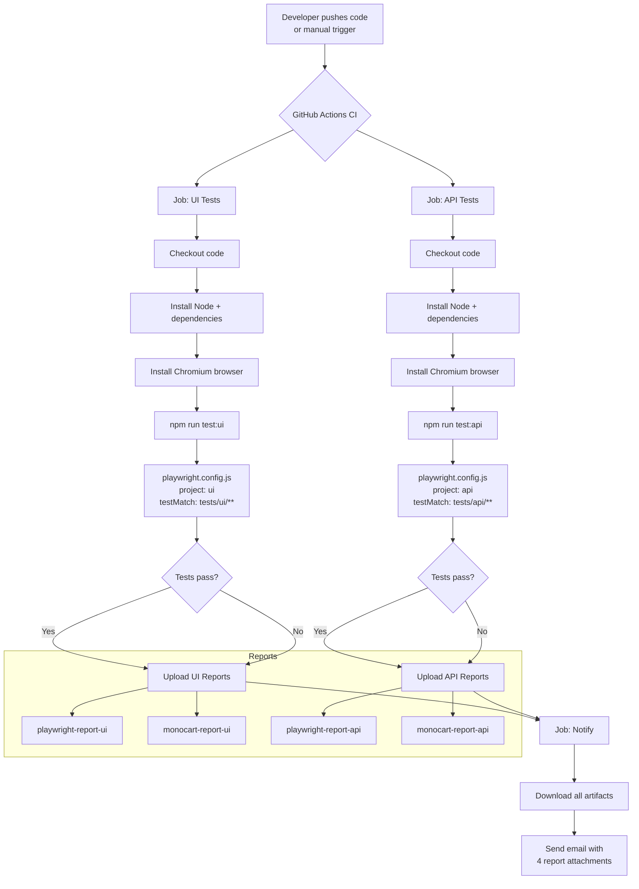

# Kaashen-Playwright-Challenge

Automated UI and API test framework using [Playwright](https://playwright.dev/), targeting:

- **UI**: [SauceDemo](https://www.saucedemo.com/)
- **API**: [Restful-Booker](https://restful-booker.herokuapp.com/apidoc/index.html)

[](https://github.com/Kaashen/Kaashen-Playwright-Challenge/actions/workflows/ci.yml)

---

## Repository Flow



---

## Project Structure

```
Kaashen-Playwright-Challenge/
├── .github/
│   └── workflows/
│       └── ci.yml                  # GitHub Actions CI pipeline
├── helpers/
│   ├── apiHelper.js                # ApiHelper class (CRUD wrappers)
│   └── testData.js                 # Shared credentials and fixtures
├── pages/                          # Page Object Model (UI only)
├── test-data/                      # JSON fixture files
├── tests/
│   ├── ui/                         # SauceDemo browser tests
│   │   ├── auth.tests.js
│   │   ├── inventory.tests.js
│   │   ├── cart.tests.js
│   │   ├── checkout.tests.js
│   │   └── visual.tests.js
│   └── api/                        # Restful-Booker API tests
│       ├── 01-health.tests.js
│       ├── 02-auth.tests.js
│       └── 03-booking.tests.js
├── playwright.config.js            # Main config (UI + API projects)
├── playwright.docker.config.js     # Docker config (snapshot generation)
├── docker-compose.yml              # Docker runner
└── package.json
```

---

## Test Types

Both UI and API tests support **snapshot assertions** (`toMatchSnapshot()`) for regression detection and **Docker** for generating Linux-compatible baselines that match CI. Tests are tagged `@smoke` or `@regression` for selective runs.

### UI Tests — SauceDemo

Browser-based end-to-end tests using the `Desktop Chrome` device profile against `https://www.saucedemo.com`. Uses the **Page Object Model** pattern — each page has a corresponding class in `pages/`.

| File | Suite | Tests |
|------|-------|-------|
| `auth.tests.js` | Authentication | Valid login, locked user, invalid credentials, empty credentials, problem user login, problem user broken sort, direct URL redirect, logout |
| `inventory.tests.js` | Inventory | 6 products, sort A-Z, sort Z-A, sort price low-high, sort price high-low, item detail, add to cart from detail |
| `cart.tests.js` | Cart | Add item, add multiple items, remove from inventory, remove from cart page, cart contents, cart persists after refresh |
| `checkout.tests.js` | Checkout | Complete flow, multiple items, missing first name, missing last name, missing zip code, cancel |
| `visual.tests.js` | Visual Regression | Login page, inventory page, cart page, checkout page |

### API Tests — Restful-Booker

Headless API tests using Playwright's built-in `request` context against `https://restful-booker.herokuapp.com`. Uses the **ApiHelper** class in `helpers/apiHelper.js` to wrap all HTTP calls. All API tests use `toMatchSnapshot()` to snapshot response shapes as `*-linux.json` files for regression detection.

| File | Suite | Tests |
|------|-------|-------|
| `01-health.tests.js` | Health Check | GET /ping returns 201 |
| `02-auth.tests.js` | Authentication | Valid token, invalid credentials, empty credentials, missing password, missing username, invalid token returns 403 |
| `03-booking.tests.js` | Booking CRUD | GET list, filter by firstname, filter by lastname, filter by dates, response time, POST create, POST response time, schema validation, missing fields returns 500, GET by ID, invalid ID returns 404, PUT update, PUT without auth, PUT invalid ID returns 405, PATCH update, PATCH without auth, DELETE without auth, DELETE invalid ID returns 405, DELETE and verify |

---

## Setup

### Prerequisites

Install the following before cloning:

| Tool | Version | Download |
|------|---------|----------|
| Node.js | v24 | [nodejs.org](https://nodejs.org) |
| Git | latest | [git-scm.com](https://git-scm.com) |
| Docker Desktop | latest | [docker.com/products/docker-desktop](https://www.docker.com/products/docker-desktop) — required for snapshot generation |

### First-time setup

**1. Clone the repo**
```bash
git clone https://github.com/Kaashen/Kaashen-Playwright-Challenge.git
cd Kaashen-Playwright-Challenge
```

**2. Install dependencies**
```bash
npm install
```

**3. Install Playwright browsers**
```bash
npx playwright install chromium
```

**4. Run all tests**
```bash
npm test
```

No `.env` files, credentials, or API keys are required — both SauceDemo and Restful-Booker are public APIs.

### Snapshot setup (required before pushing new tests)

Snapshots must be generated inside a Linux Docker container to match the CI environment. Run once after cloning, and again whenever you add a new `toMatchSnapshot()` or `toHaveScreenshot()` assertion.

**Step 1 — Generate snapshots (Windows PowerShell):**
```powershell
docker run --rm -v "${PWD}:/work" -w /work mcr.microsoft.com/playwright:v1.61.0-noble `
  npx playwright test --update-snapshots
```

**Step 1 — Generate snapshots (Mac/Linux):**
```bash
docker run --rm -v $(pwd):/work -w /work mcr.microsoft.com/playwright:v1.61.0-noble \
  npx playwright test --update-snapshots
```

**Step 2 — Verify tests pass against new snapshots:**
```powershell
docker run --rm -v "${PWD}:/work" -w /work mcr.microsoft.com/playwright:v1.61.0-noble `
  npx playwright test
```

Then commit the generated snapshot files:
```bash
git add tests/
git commit -m "Update snapshots"
git push
```

---

## Running Tests

### All tests
```bash
npm test
```

### UI tests only
```bash
npm run test:ui
```

### API tests only
```bash
npm run test:api
```

### Smoke tests only
```bash
npx playwright test --grep @smoke
```

### Regression tests only
```bash
npx playwright test --grep @regression
```

### One specific test file
```bash
npx playwright test tests/api/02-auth.tests.js
npx playwright test tests/ui/auth.tests.js
```

### One specific test by name
```bash
npx playwright test --grep "valid credentials return a token"
```

### With headed browser (UI tests)
```bash
npx playwright test --project=ui --headed
```

---

## Docker Tests

Docker runs tests inside a Linux container matching the CI environment — required for generating `*-linux.json` snapshots that CI uses for comparison. This applies equally to both UI and API tests.

### Run via docker-compose (snapshot generation)
```bash
docker-compose up
```

### Run specific tests in Docker (PowerShell)

```powershell
# All tests + update snapshots
docker run --rm -v "${PWD}:/work" -w /work mcr.microsoft.com/playwright:v1.61.0-noble `
  npx playwright test --update-snapshots

# UI tests only + update snapshots
docker run --rm -v "${PWD}:/work" -w /work mcr.microsoft.com/playwright:v1.61.0-noble `
  npx playwright test tests/ui/ --update-snapshots

# API tests only + update snapshots
docker run --rm -v "${PWD}:/work" -w /work mcr.microsoft.com/playwright:v1.61.0-noble `
  npx playwright test tests/api/ --update-snapshots

# Run all tests without updating snapshots
docker run --rm -v "${PWD}:/work" -w /work mcr.microsoft.com/playwright:v1.61.0-noble `
  npx playwright test
```

### Run specific tests in Docker (Mac/Linux)

```bash
# All tests + update snapshots
docker run --rm -v $(pwd):/work -w /work mcr.microsoft.com/playwright:v1.61.0-noble \
  npx playwright test --update-snapshots

# UI tests only + update snapshots
docker run --rm -v $(pwd):/work -w /work mcr.microsoft.com/playwright:v1.61.0-noble \
  npx playwright test tests/ui/ --update-snapshots

# API tests only + update snapshots
docker run --rm -v $(pwd):/work -w /work mcr.microsoft.com/playwright:v1.61.0-noble \
  npx playwright test tests/api/ --update-snapshots

# Run all tests without updating snapshots
docker run --rm -v $(pwd):/work -w /work mcr.microsoft.com/playwright:v1.61.0-noble \
  npx playwright test
```

### Normal Playwright vs Docker — when to use which

| | Normal (`npx playwright test`) | Docker |
|---|---|---|
| **When to use** | Local development and debugging | Generating Linux snapshots for CI |
| **Snapshot files** | `*-win32.json` / `*-darwin.json` | `*-linux.json` ✅ matches CI |
| **Speed** | Fast | Slower (container startup) |
| **Headed mode** | Supported | Not supported |
| **Config** | `playwright.config.js` | `playwright.docker.config.js` |

---

## Adding a Test

Both UI and API tests follow the same pattern: write the test, add a snapshot assertion, generate the Linux baseline with Docker, then commit.

### Adding a UI test

1. Create or open a file in `tests/ui/`
2. Import the relevant page object from `pages/`
3. Write your test with a tag and snapshot:

```js
import { test, expect } from '@playwright/test';
import { users } from '../../helpers/testData.js';
import { LoginPage } from '../../pages/LoginPage.js';

test.describe('My new suite', () => {
  test('@regression does something', async ({ page }) => {
    const loginPage = new LoginPage(page);
    await loginPage.goto();
    await loginPage.login(users.valid.username, users.valid.password);
    await expect(page).toHaveURL(/inventory/);
    expect(JSON.stringify({ loggedIn: true }))
      .toMatchSnapshot('my-ui-snapshot.json');
  });
});
```

4. Generate the Linux snapshot and verify:

```powershell
docker run --rm -v "${PWD}:/work" -w /work mcr.microsoft.com/playwright:v1.61.0-noble `
  npx playwright test tests/ui/ --update-snapshots

docker run --rm -v "${PWD}:/work" -w /work mcr.microsoft.com/playwright:v1.61.0-noble `
  npx playwright test tests/ui/
```

5. Commit the generated `tests/ui/*.tests.js-snapshots/*-linux.json` files.

### Adding an API test

1. Create or open a file in `tests/api/`
2. Import `ApiHelper` and test data from `helpers/`
3. Write your test with a tag and snapshot:

```js
import { test, expect } from '@playwright/test';
import { ApiHelper } from '../../helpers/apiHelper.js';

test.describe('My API suite', () => {
  test('@regression GET /booking returns 200', async ({ request }) => {
    const api = new ApiHelper(request);
    const response = await api.getBookings();
    expect(response.status()).toBe(200);
    const body = await response.json();
    expect(JSON.stringify({ isArray: Array.isArray(body) }))
      .toMatchSnapshot('my-api-snapshot.json');
  });
});
```

4. Generate the Linux snapshot and verify:

```powershell
docker run --rm -v "${PWD}:/work" -w /work mcr.microsoft.com/playwright:v1.61.0-noble `
  npx playwright test tests/api/ --update-snapshots

docker run --rm -v "${PWD}:/work" -w /work mcr.microsoft.com/playwright:v1.61.0-noble `
  npx playwright test tests/api/
```

5. Commit the generated `tests/api/*.tests.js-snapshots/*-linux.json` files.

---

## Viewing Reports

```bash
# Playwright HTML report (opens in browser)
npm run report

# Monocart report (Windows)
npm run report:monocart
```

Reports are also emailed automatically after every CI run with all four reports attached (UI + API, Playwright + Monocart).

---

## CI/CD

Tests run automatically via GitHub Actions (`.github/workflows/ci.yml`) on:

- Every **push** to `main`
- Every **pull request** to `main`
- **Daily at 6am UTC** (8am South Africa time) via scheduled cron
- **Manually** via the Actions tab → Run workflow button

The pipeline runs UI and API jobs in parallel, then a `notify` job sends a combined email with all four report files attached. Snapshots are **never auto-updated in CI** — if a snapshot mismatch causes a failure, update snapshots locally using Docker, then push.

### Required GitHub Secrets

| Secret | Description |
|--------|-------------|
| `MAIL_USERNAME` | Gmail address used to send reports |
| `MAIL_PASSWORD` | Gmail App Password (not your login password) |
| `MAIL_TO` | Recipient email address |