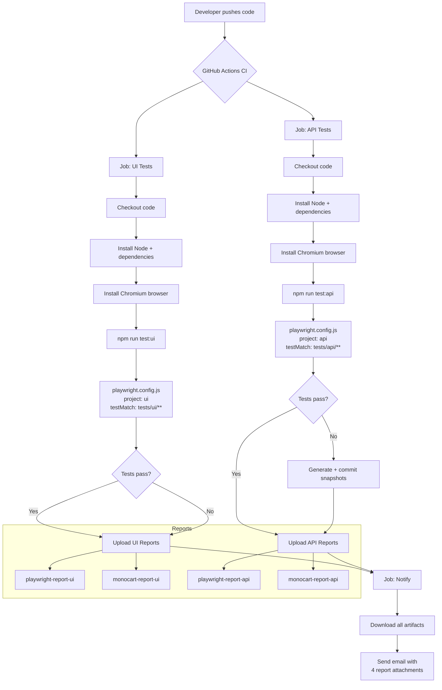

# Kaashen-Playwright-Challenge

Automated UI and API test framework using [Playwright](https://playwright.dev/), targeting:

- **UI**: [SauceDemo](https://www.saucedemo.com/)
- **API**: [Restful-Booker](https://restful-booker.herokuapp.com/apidoc/index.html)

[](https://github.com/Kaashen/Kaashen-Playwright-Challenge/actions/workflows/ci.yml)

---

## Repository Flow



---

## Project Structure

```
Kaashen-Playwright-Challenge/
├── .github/
│   └── workflows/
│       └── ci.yml                  # GitHub Actions CI pipeline
├── helpers/
│   ├── apiHelper.js                # ApiHelper class (CRUD wrappers)
│   └── testData.js                 # Shared credentials and fixtures
├── pages/                          # Page Object Model (UI only)
├── test-data/                      # JSON fixture files
├── tests/
│   ├── ui/                         # SauceDemo browser tests
│   │   ├── auth.tests.js
│   │   ├── inventory.tests.js
│   │   ├── cart.tests.js
│   │   └── checkout.tests.js
│   └── api/                        # Restful-Booker API tests
│       ├── 01-health.tests.js
│       ├── 02-auth.tests.js
│       └── 03-booking.tests.js
├── playwright.config.js            # Main config (UI + API projects)
├── playwright.docker.config.js     # Docker config (snapshot generation)
├── docker-compose.yml              # Docker runner
└── package.json
```

---

## Test Types

### UI Tests — SauceDemo

Browser-based end-to-end tests using the `Desktop Chrome` device profile against `https://www.saucedemo.com`. Uses the **Page Object Model** pattern — each page has a corresponding class in `pages/`.

| File | Suite | Tests |
|------|-------|-------|
| `auth.tests.js` | Authentication | Valid login, locked user, invalid credentials, logout |
| `inventory.tests.js` | Inventory | Product count, sort by price, sort by name, item detail |
| `cart.tests.js` | Cart | Add/remove items, badge count, cart contents |
| `checkout.tests.js` | Checkout | Complete flow, field validation, cancel |

### API Tests — Restful-Booker

Headless API tests using Playwright's built-in `request` context against `https://restful-booker.herokuapp.com`. Uses the **ApiHelper** class in `helpers/apiHelper.js` to wrap all HTTP calls. All API tests snapshot their responses as `*-linux.json` files for regression detection.

| File | Suite | Tests |
|------|-------|-------|
| `01-health.tests.js` | Health Check | GET /ping returns 201 |
| `02-auth.tests.js` | Authentication | Valid token, invalid credentials, empty credentials, missing field |
| `03-booking.tests.js` | Booking CRUD | GET list, filter by name, filter by dates, POST create, schema validation, GET by ID, invalid ID, PUT update, PUT without auth, PATCH partial update, DELETE without auth, DELETE and verify |

---

## Setup

```bash
npm install
npx playwright install chromium
```

---

## Running Tests

### All tests

```bash
npm test
```

### UI tests only

```bash
npm run test:ui
```

### API tests only

```bash
npm run test:api
```

### One specific test file

```bash
npx playwright test tests/api/02-auth.tests.js
npx playwright test tests/ui/auth.tests.js
```

### One specific test by name

```bash
npx playwright test --grep "valid credentials return a token"
```

### With headed browser (UI tests)

```bash
npx playwright test --project=ui --headed
```

### Update API snapshots (after adding new snapshot assertions)

```bash
npx playwright test tests/api/ --update-snapshots
```

---

## Docker Tests

Docker runs tests inside a Linux container matching the CI environment — required for generating `*-linux.json` snapshots that CI uses for comparison.

### Run via docker-compose (snapshot generation)

```bash
docker-compose up
```

This runs `playwright.docker.config.js` with `--update-snapshots`, writing Linux-compatible snapshot files to `tests/api/**-snapshots/`.

### Run specific tests in Docker (PowerShell)

```powershell
# All API tests
docker run --rm -v "${PWD}:/work" -w /work mcr.microsoft.com/playwright:v1.61.0-noble `
  npx playwright test tests/api/ --update-snapshots

# All tests
docker run --rm -v "${PWD}:/work" -w /work mcr.microsoft.com/playwright:v1.61.0-noble `
  npx playwright test
```

### Run specific tests in Docker (bash/Mac/Linux)

```bash
# All API tests
docker run --rm -v $(pwd):/work -w /work mcr.microsoft.com/playwright:v1.61.0-noble \
  npx playwright test tests/api/ --update-snapshots

# All tests
docker run --rm -v $(pwd):/work -w /work mcr.microsoft.com/playwright:v1.61.0-noble \
  npx playwright test
```

### Normal Playwright vs Docker — when to use which

| | Normal (`npx playwright test`) | Docker |
|---|---|---|
| **When to use** | Local development and debugging | Generating Linux snapshots for CI |
| **Snapshot files** | `*-win32.json` / `*-darwin.json` | `*-linux.json` ✅ matches CI |
| **Speed** | Fast | Slower (container startup) |
| **Headed mode** | Supported | Not supported |
| **Config** | `playwright.config.js` | `playwright.docker.config.js` |

---

## Adding a Test

### Adding a UI test

1. Create or open a spec file in `tests/ui/`
2. Import the relevant page object from `pages/`
3. Write your test:

```js
import { test, expect } from '@playwright/test';
import { LoginPage } from '../../pages/LoginPage.js';

test.describe('My new suite', () => {
  test('does something', async ({ page }) => {
    const loginPage = new LoginPage(page);
    await loginPage.goto();
    await loginPage.login('standard_user', 'secret_sauce');
    await expect(page).toHaveURL(/inventory/);
  });
});
```

### Adding an API test

1. Create or open a spec file in `tests/api/`
2. Import `ApiHelper` and test data from `helpers/`
3. Write your test and include a snapshot assertion:

```js
import { test, expect } from '@playwright/test';
import { auth } from '../../helpers/testData.js';
import { ApiHelper } from '../../helpers/apiHelper.js';

test.describe('My API suite', () => {
  test('GET /booking returns 200', async ({ request }) => {
    const api = new ApiHelper(request);
    const response = await api.getBookings();
    expect(response.status()).toBe(200);
    const body = await response.json();
    expect(JSON.stringify({ isArray: Array.isArray(body) }))
      .toMatchSnapshot('my-test-snapshot.json');
  });
});
```

4. Generate the Linux snapshot before pushing:

```bash
docker-compose up
```

Then commit the generated `tests/api/*.tests.js-snapshots/*-linux.json` files.

---

## Viewing Reports

```bash
# Playwright HTML report (opens in browser)
npm run report

# Monocart report (Windows)
npm run report:monocart
```

Reports are also emailed automatically after every CI run with all four reports attached (UI + API, Playwright + Monocart).

---

## CI/CD

Tests run automatically on every push and pull request to `main` via GitHub Actions (`.github/workflows/ci.yml`).

The pipeline runs UI and API jobs in parallel, then a `notify` job sends a combined email with all four report files attached.

### Required GitHub Secrets

| Secret | Description |
|--------|-------------|
| `MAIL_USERNAME` | Gmail address used to send reports |
| `MAIL_PASSWORD` | Gmail App Password (not your login password) |
| `MAIL_TO` | Recipient email address |
